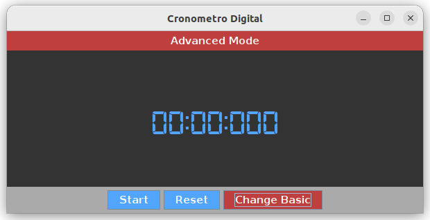
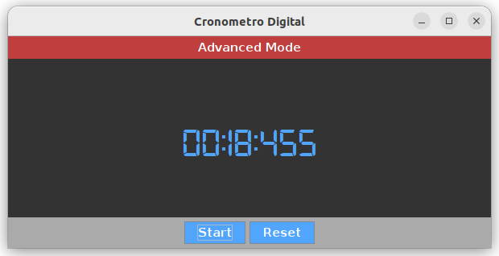

# Cronometro_Digital
App de cronometro digital hecha Java y Swing

## Descripción
Una aplicación básica de un cronometro digital con 2 modos de visualización.
* Basic Mode: Formato de minutos y segundos (mm:ss).
* Advanced Mode: Formato de minutos, segundos y decimales (mm:ss:ddd).

## Funcionamiento

### Basic Mode

Muestra el cronometro inicial con 3 botones:
* Start: Iniciar o continuar el cronometro.
* Reset: Reiniciar el cronometro a 00:00.
* Change Advanced: Cambiar al modo avanzado.

### Advanced Mode

Muestra el cronometro inicial con 3 botones:
* Start: Iniciar o continuar el cronometro.
* Reset: Reiniciar el cronometro a 00:00:000.
* Change Basic* Cambiar al modo básico.

### Muestra de funcionamiento

El cronometro en funcionamiento con 3 botones:
* Stop: Detener el cronometro (solo se muestra mientras está en funcionamiento.
* Start: Continuar el cronometro.
* Reset: Reiniciar el cronometro.
